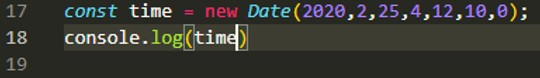

# Data-and-time

In JavaScript, date and time are represented by the Date object. The Date object provides the date and time information and also provides various methods. A JavaScript date defines the EcmaScript epoch that represents milliseconds since 1 January 1970 UTC. This date and time is the same as the UNIX epoch (predominant base value for computer-recorded date and time values).

(tajik language)
Дар JavaScript сана ва вақт бо объекти Date муаррифӣ мешавад. 
Объекти Date маълумоти сана ва вақтро пешниҳод мекунад ва инчунин усулҳои 
гуногунро пешниҳод мекунад. Санаи JavaScript давраи EcmaScript-ро муайян мекунад, ки 
миллисонияҳоро аз 1 январи соли 1970 UTC ифода мекунад. Ин сана ва вақт бо давраи UNIX 
якхела аст (қимати бартаридошта барои арзишҳои сана ва вақт, ки дар компютер сабт шудааст). 

## new Date()

result

## new Date(milliseconds)

result

## new Date (date string) 

result

## new Date (year, month, day, hours, minutes, seconds, milliseconds) 

result

## Date methods Java Script

now()
getFullYear()
getMonth()
getDate()
getDay()
getHours()
getMinutes()
getUTCDate()
setFullYear()
setMonth()
setDate()
setUTCDate()

## now()

result

## getFullYear ()

result

## getMonth ()

result

## getDate ()

result

## getDay ()

result

## getHours ()

result

## getMinutes ()

result

## setFullYear ()

result

## setMonth ()

result

## setDate ()

result

